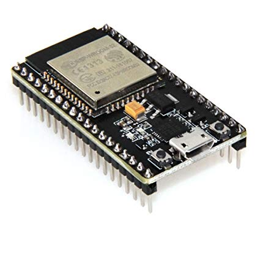
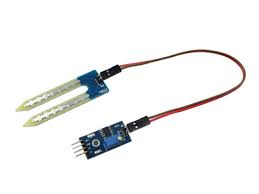
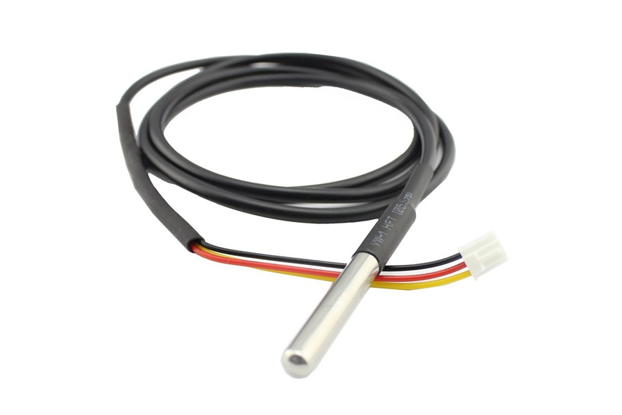

## I'm going to tell you how we aim to revolutionize agriculture

---

# Our Team:
 ## Raunak Kondiboyina
 ## Rohan Sethi
 ## Piyush Pandwal

---

## Tech Tracks :
 - Machine Learning
 - IoT(Internet of Things)

---

# IoT(Internet of Things)
## Esp-32
 A low cost unit with 
 built in WiFi and bluetooth
 It acts as an interface 
 Between sensors and thingsSpeak
 
Format: 

---

# IoT(Internet of Things)
## Humidity Sensor 
 Measures cubic meter of 
 water per cubic meter of soil
 *(Unit : percentage)*
 
Format: 

---

# IoT(Internet of Things)
## Temperature Sensor 
 Measures temperature of Soil 
 *(Unit : Celsius)*
 
Format: 

---

# IoT(Internet of Things)
### pH sensor  
 Measures pH of an aqueous 
 solution of soil 
 *(Range : 0-14)*
 .jpeg)
Format: 

---

# Machine Learning
## Crop Prediction
 *Decision Tree*

---

# Machine Learning
## Disease Identification
 *Convoluted Neural Networks*

---

# Machine Learning
## Smart surveillance
 *Google vision API*

---

# Machine Learing
## Fertilizer Pattern 
 *Based on historical Data*
